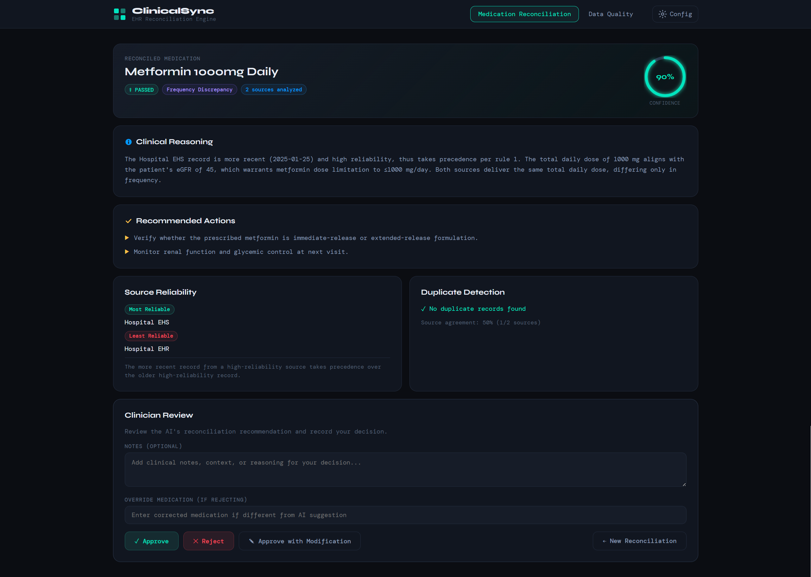

# ClinicalSync — EHR Reconciliation Engine

A full-stack clinical data reconciliation application that uses AI (Google Gemini 1.5 Flash — **free tier**) to determine the most accurate medication information from conflicting healthcare records.

---

## Table of Contents
1. [Quick Start](#quick-start)
2. [Get Your Free API Key](#get-your-free-api-key)
3. [Architecture](#architecture)
4. [API Reference](#api-reference)
5. [Prompt Engineering Approach](#prompt-engineering-approach)
6. [Design Decisions & Trade-offs](#design-decisions--trade-offs)
7. [Running Tests](#running-tests)
8. [Docker Deployment](#docker-deployment)
9. [What I'd Improve With More Time](#what-id-improve-with-more-time)
10. [Time Spent](#time-spent)

---

## Quick Start

### Prerequisites
- Node.js 18+
- A **free** Gemini API key (see below)

### 1. Clone & Install

```bash
git clone <your-repo-url>
cd ehr-reconciliation

# Backend
cd backend
npm install
cp .env.example .env

# Frontend (separate terminal)
cd ../frontend
npm install
```

### 2. Get Your Free API Key

1. Go to **https://aistudio.google.com/app/apikey**
2. Sign in with your Google account
3. Click **"Create API Key"**
4. Copy the key (starts with `AIza...`)

**Free tier limits** — more than enough for development and demos:

| Metric | Limit |
|---|---|
| Requests / day | 1,500 |
| Requests / minute | 15 |
| Tokens / minute | 1,000,000 |
| Cost | **$0** |

### 3. Configure Environment

Edit `backend/.env`:

```env
PORT=3001
GEMINI_API_KEY=AIza...your-key-here
API_SECRET_KEY=any-secret-you-choose
NODE_ENV=development
CACHE_TTL_SECONDS=3600
```

### 4. Run

**Terminal 1 — Backend:**
```bash
cd backend
npm run dev
# → API running at http://localhost:3001
```

**Terminal 2 — Frontend:**
```bash
cd frontend
npm run dev
# → UI running at http://localhost:3000
```

### 5. Configure the UI

Open **http://localhost:3000**, click **"Config"** in the top-right header, and enter the same `API_SECRET_KEY` you set in `.env`.

Click **"Load Sample Data"** on either page to try the app immediately without typing anything.

---

## Architecture

```
ehr-reconciliation/
├── backend/
│   ├── src/
│   │   ├── index.js                      # Server entry point
│   │   ├── app.js                        # Express app, middleware wiring
│   │   ├── routes/
│   │   │   └── reconcile.js              # Route handlers + decision store
│   │   ├── services/
│   │   │   ├── aiService.js              # Google Gemini integration
│   │   │   ├── cacheService.js           # In-memory cache (node-cache)
│   │   │   └── reconciliationService.js  # Core logic + duplicate detection
│   │   ├── middleware/
│   │   │   ├── auth.js                   # API key authentication
│   │   │   ├── validation.js             # Joi input validation
│   │   │   └── errorHandler.js           # Centralized error handling
│   │   └── utils/
│   │       └── logger.js                 # Winston structured logger
│   └── tests/
│       ├── reconciliationService.test.js # Unit tests (pure logic)
│       └── api.test.js                   # Integration tests (supertest)
│
├── frontend/
│   └── src/
│       ├── App.jsx                       # Shell, global CSS vars, tab nav
│       ├── pages/
│       │   ├── ReconcilePage.jsx         # Medication reconciliation form
│       │   └── ValidatePage.jsx          # Data quality validation form
│       ├── components/
│       │   ├── ReconcileResult.jsx       # Result display + clinician decision panel
│       │   ├── QualityResult.jsx         # Quality score visualizations
│       │   ├── SourceForm.jsx            # Dynamic source entry (add/remove/expand)
│       │   ├── ConfidenceRing.jsx        # Animated SVG confidence ring
│       │   ├── ScoreBar.jsx              # Score bar with red/yellow/green color
│       │   └── SettingsModal.jsx         # API key configuration modal
│       └── utils/
│           ├── api.js                    # Fetch wrappers with auth headers
│           └── sampleData.js             # Pre-built test scenarios
│
├── docker-compose.yml
└── README.md
```

### Request Flow

```
User submits form
  → Frontend validates locally (min 2 sources, required fields)
  → POST /api/reconcile/medication  (X-API-Key header)
  → auth.js checks API key
  → validation.js checks Joi schema
  → reconciliationService:
      ├── detectDuplicates()       — Levenshtein similarity across sources
      ├── calculateSourceAgreement() — weighted reliability scoring
      └── aiService.reconcileMedication()
            ├── Check node-cache (hash of input)
            ├── Cache miss → build structured prompt
            ├── Call Gemini 1.5 Flash (responseMimeType: application/json)
            ├── Parse + validate JSON response
            └── Store in cache (1hr TTL)
  → Augment result with duplicate/agreement meta
  → Return to frontend
  → Render: confidence ring, reasoning, actions, source weights
  → Clinician clicks Approve/Reject/Modify
  → POST /api/reconcile/decision/:id  → stored in-memory Map
```

---

## API Reference

All `/api/*` endpoints require the header `X-API-Key: <your-secret>`.  
The `/health` endpoint requires no auth.

---

### `GET /health`

Returns service health. No authentication required.

**Response:**
```json
{
  "status": "healthy",
  "service": "EHR Reconciliation Engine",
  "version": "1.0.0",
  "cache": { "hits": 4, "misses": 2, "keys": 2 },
  "timestamp": "2025-01-25T10:00:00.000Z"
}
```

---

### `POST /api/reconcile/medication`

Reconcile conflicting medication records using AI.

**Request body:**
```json
{
  "patient_context": {
    "age": 67,
    "conditions": ["Type 2 Diabetes", "Hypertension"],
    "recent_labs": { "eGFR": 45 }
  },
  "sources": [
    {
      "system": "Hospital EHR",
      "medication": "Metformin 1000mg twice daily",
      "last_updated": "2024-10-15",
      "source_reliability": "high"
    },
    {
      "system": "Primary Care",
      "medication": "Metformin 500mg twice daily",
      "last_updated": "2025-01-20",
      "source_reliability": "high"
    },
    {
      "system": "Pharmacy",
      "medication": "Metformin 1000mg daily",
      "last_filled": "2025-01-25",
      "source_reliability": "medium"
    }
  ]
}
```

**Validation rules:**
- `patient_context` — required
- `sources` — array, min 2, max 20
- Each source requires `system`, `medication`, and at least one of `last_updated` or `last_filled`
- `source_reliability` — `"high"`, `"medium"`, or `"low"`

**Response:**
```json
{
  "request_id": "c5b6f4a7-42b2-4425-b21b-da34989cc7ff",
  "reconciled_medication": "Metformin 500mg twice daily",
  "confidence_score": 0.88,
  "reasoning": "Primary care record is the most recent clinical encounter. Dose reduction is clinically appropriate given declining kidney function (eGFR 45). The pharmacy fill likely reflects an older prescription.",
  "recommended_actions": [
    "Update Hospital EHR to Metformin 500mg twice daily",
    "Verify with pharmacist that correct dose is being dispensed"
  ],
  "clinical_safety_check": "PASSED",
  "source_weights": {
    "most_reliable": "Primary Care",
    "least_reliable": "Pharmacy",
    "explanation": "Primary care has the most recent update and high reliability rating"
  },
  "conflict_type": "dose_discrepancy",
  "meta": {
    "sources_analyzed": 3,
    "duplicate_records": [],
    "source_agreement": {
      "agreement_ratio": 0.33,
      "total_sources": 3,
      "agreeing_sources": 1,
      "weighted_reliability": 2.33
    },
    "processed_at": "2025-01-25T10:00:00.000Z"
  }
}
```

---

### `POST /api/validate/data-quality`

Score a patient record across four quality dimensions.

**Request body:**
```json
{
  "demographics": { "name": "John Doe", "dob": "1955-03-15", "gender": "M" },
  "medications": ["Metformin 500mg", "Lisinopril 10mg"],
  "allergies": [],
  "conditions": ["Type 2 Diabetes"],
  "vital_signs": { "blood_pressure": "340/180", "heart_rate": 72 },
  "last_updated": "2024-06-15"
}
```

**Response:**
```json
{
  "request_id": "uuid",
  "overall_score": 62,
  "breakdown": {
    "completeness": 60,
    "accuracy": 50,
    "timeliness": 70,
    "clinical_plausibility": 40
  },
  "issues_detected": [
    {
      "field": "allergies",
      "issue": "No allergies documented — likely incomplete rather than truly none",
      "severity": "medium"
    },
    {
      "field": "vital_signs.blood_pressure",
      "issue": "Blood pressure 340/180 is physiologically implausible",
      "severity": "high"
    },
    {
      "field": "last_updated",
      "issue": "Record is 7+ months old",
      "severity": "medium"
    }
  ],
  "summary": "Record has significant quality issues including an implausible vital sign and stale data.",
  "requires_immediate_review": true
}
```

---

### `POST /api/reconcile/decision/:requestId`

Record a clinician's review decision on a reconciliation result.

**Request body:**
```json
{
  "decision": "approved",
  "clinician_notes": "Confirmed with patient during visit",
  "override_medication": null
}
```

- `decision`: `"approved"`, `"rejected"`, or `"modified"`
- `override_medication`: provide corrected medication string if decision is `"modified"`

**Response:**
```json
{
  "success": true,
  "request_id": "c5b6f4a7-...",
  "decision": "approved",
  "clinician_notes": "Confirmed with patient during visit",
  "decided_at": "2025-01-25T10:05:00.000Z"
}
```

---

### `GET /api/reconcile/decisions`

Retrieve all recorded clinician decisions (in-memory, resets on server restart).

**Response:**
```json
{
  "total": 3,
  "decisions": [
    {
      "request_id": "...",
      "decision": "approved",
      "clinician_notes": "...",
      "decided_at": "..."
    }
  ]
}
```

---

## Prompt Engineering Approach

### Core Philosophy

Prompts give Gemini maximum clinical context while constraining output to a strict JSON schema. Using `responseMimeType: "application/json"` in the Gemini config enforces JSON-only output at the model level — no markdown fences, no preamble.

### Reconciliation Prompt Design

```
System instruction:
  └── Role: clinical pharmacist AI
  └── Constraint: valid JSON only, no extra fields

User prompt structure:
  ├── PATIENT CONTEXT block
  │     age, conditions, recent labs (e.g. eGFR for kidney function)
  ├── CONFLICTING SOURCES block
  │     each source: system name, medication, date, reliability tier
  ├── PRIORITY RULES (ordered)
  │     1. Recency × reliability
  │     2. Pharmacy fill = actual dispensing evidence
  │     3. Primary care = active prescription
  │     4. Labs/conditions can override dose
  │     5. Patient portal = least reliable (self-reported)
  └── EXACT JSON SCHEMA
        reconciled_medication, confidence_score, reasoning,
        recommended_actions, clinical_safety_check,
        source_weights, conflict_type
```

Including clinical lab values (like eGFR for kidney function) is intentional — a declining eGFR is a textbook reason to reduce Metformin dosage, and the AI uses that to explain *why* the most recent lower dose is correct.

### Data Quality Prompt Design

```
System instruction:
  └── Role: clinical data quality analyst

User prompt structure:
  ├── Full patient record (JSON-formatted)
  ├── Today's date (for timeliness calculation)
  ├── Scoring rubric per dimension with explicit deduction rules:
  │     - BP > 300 systolic = −30 pts accuracy
  │     - HR < 20 or > 300 = −30 pts accuracy
  │     - Empty allergies = −10 pts completeness
  │     - > 6 months old = −15 pts timeliness
  │     - > 12 months old = −30 pts timeliness
  └── EXACT JSON SCHEMA
        overall_score, breakdown{4 dimensions}, issues_detected[], summary, requires_immediate_review
```

### Caching Strategy

Responses are cached by a deterministic integer hash of the sorted-JSON-serialized input, keyed as `reconcile_<hash>` or `validate_<hash>`. Default TTL is 1 hour (configurable via `CACHE_TTL_SECONDS`).

Rationale: identical inputs within a clinical session should return consistent results, and caching eliminates redundant API calls which count against the free-tier daily quota.

---

## Design Decisions & Trade-offs

| Decision | Rationale | Trade-off |
|---|---|---|
| **Google Gemini 1.5 Flash (free)** | 1,500 req/day at zero cost; `responseMimeType: application/json` enforces structured output at the model level | 15 req/min rate limit; not suitable for high-throughput production without upgrading |
| **In-memory cache (node-cache)** | Zero extra dependencies, fast, sufficient for single-instance demo | Doesn't survive restarts; Redis needed for multi-instance or persistent caching |
| **Joi validation before AI call** | Catches malformed inputs before spending API quota | Extra ~5ms per request |
| **No database** | Keeps setup to `npm install` only; decisions stored in a Map | Lost on restart; real app needs PostgreSQL |
| **Levenshtein similarity for duplicates** | Language-agnostic, works on raw medication strings, no external dependencies | A production system should use RxNorm/RxCUI drug codes for pharmaceutical-grade matching |
| **`responseMimeType: application/json`** | Guarantees JSON output from Gemini without needing to strip markdown fences | Requires `@google/generative-ai` ≥ 0.12; older versions don't support this config |
| **Exponential backoff retry (3 attempts)** | Handles transient quota errors gracefully without crashing | Adds up to 7 seconds of latency on worst-case retry path |
| **React without a routing library** | Two-tab app doesn't need React Router; keeps bundle small | No URL-based navigation or browser history support |
| **Vite dev proxy** | No CORS configuration needed during local development | Requires nginx reverse proxy in production (handled in Docker) |

---

## Running Tests

```bash
cd backend
npm test                    # Run all 25 tests
npm test -- --coverage      # With coverage report
```

**Test coverage:**

| Module | What's tested |
|---|---|
| `reconciliationService` | `normalizeMedication`, `similarity`, `detectDuplicates`, `calculateSourceAgreement` |
| API — Auth | 401 without key, 403 with wrong key |
| API — Reconcile | 200 with valid input, 400 with one source, 400 missing context, 400 invalid reliability |
| API — Validate | 200 with valid input, 400 with empty body |
| API — Decisions | Record approved decision, reject invalid decision value |
| Health | GET /health returns 200 |

The AI service (`aiService.js`) is mocked in tests — no real API calls are made, and no API key is needed to run the test suite.

---

## Docker Deployment

```bash
# 1. Set credentials
cp .env.example .env
# Edit .env:
#   GEMINI_API_KEY=AIza...
#   API_SECRET_KEY=your-secret

# 2. Build and start
docker compose up --build

# Frontend → http://localhost:3000
# Backend  → http://localhost:3001
# Health   → http://localhost:3001/health
```

---

## What I'd Improve With More Time

1. **RxNorm drug database integration** — normalize medication names against the RxNorm drug ontology for pharmaceutical-grade duplicate detection and drug–disease interaction checking, rather than string similarity

2. **Persistent storage (PostgreSQL)** — every reconciliation request and clinician decision should be stored permanently for compliance, audit trails, and analytics

3. **Confidence score calibration** — track AI predictions against clinician override decisions over time to empirically calibrate confidence scores (i.e., when the model says 0.88, is it actually right 88% of the time?)

4. **FHIR R4 input format** — accept HL7 FHIR `MedicationRequest` and `Patient` resources directly so the API can be plugged into real EHR systems without a transformation layer

5. **Webhook support** — emit events to registered endpoints when a reconciliation completes or when a clinician overrides an AI suggestion, enabling downstream EHR system synchronization

6. **Streaming responses** — stream Gemini's reasoning token-by-token so the UI feels responsive during long reconciliations rather than showing a spinner for 2–3 seconds

7. **User authentication (JWT)** — replace the single shared API key with role-based JWT auth (clinician, admin, read-only) with per-user rate limiting and audit logging

8. **Upgrade path to Gemini 1.5 Pro** — the current implementation is a single `MODEL_NAME` constant; swapping to Pro for higher accuracy on complex cases is a one-line change

---

## Time Spent

| Phase | Time |
|---|---|
| Requirements analysis + architecture planning | 30 min |
| Backend API, middleware, validation | 2 hr |
| AI service + prompt engineering (Gemini) | 1.5 hr |
| Reconciliation logic + duplicate detection | 1 hr |
| Unit tests + integration tests | 1 hr |
| Frontend (all components + pages) | 2.5 hr |
| Docker + README | 45 min |
| **Total** | **~9.5 hours** |

---

## Final Output
 